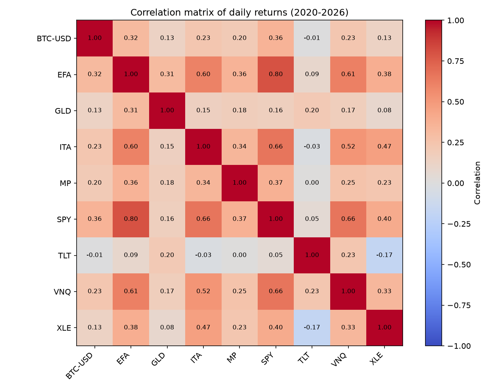
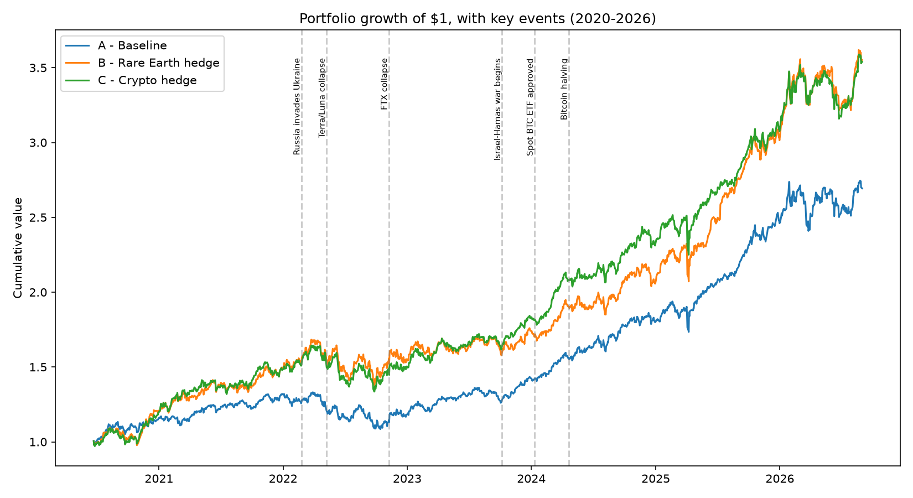
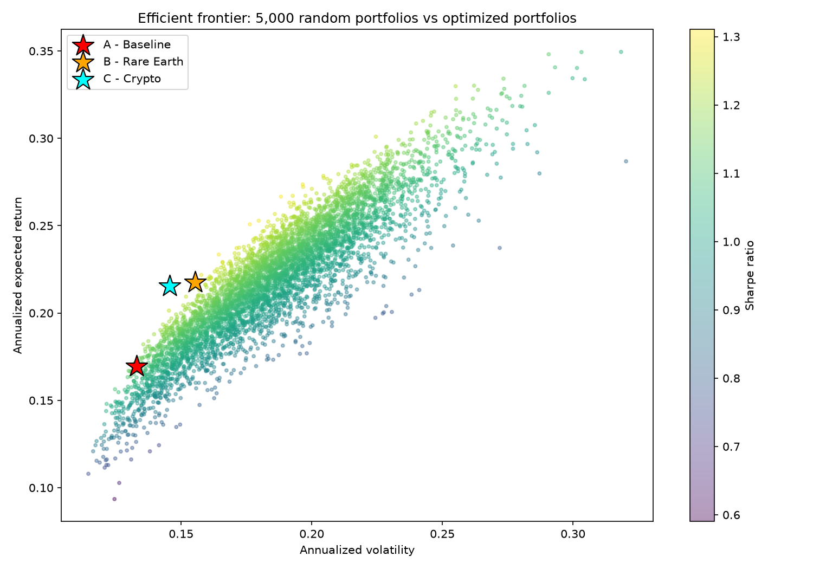
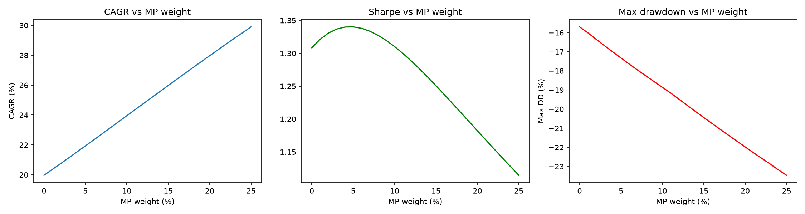

# Geopolitical Hedge & Bold Bet: A Multi-Asset Portfolio Study

Does a small, deliberate allocation to a volatile, thematically-exposed asset improve a diversified portfolio — and if so, does it work as a *hedge* or as something else?

This project builds three multi-asset portfolios, optimises them with mean-variance optimisation, and then stress-tests the thesis with event studies, risk decomposition, tail-risk metrics, an out-of-sample test, and a weight-sensitivity analysis.

---

## The question

A standard diversified portfolio is the default recommendation. But in a period of sustained geopolitical tension, does tilting towards defence, energy and critical-minerals exposure — plus a single concentrated "bold bet" — actually pay off?

And crucially: **if it pays off, why?** Is it protection during crises (a hedge), or simply a higher-risk, higher-return position (a convex bet)? These are different claims with different implications, and they are often conflated.

---

## Portfolio design

Three portfolios, optimised for maximum Sharpe ratio, no short-selling:

| Portfolio | Core assets (optimised) | Bold bet (weight fixed at 7%) |
|---|---|---|
| **A — Baseline** | SPY, TLT, GLD, EFA, VNQ | none |
| **B — Rare Earth tilt** | SPY, TLT, GLD, ITA, XLE | MP (MP Materials) |
| **C — Crypto tilt** | SPY, TLT, GLD, ITA, XLE | BTC-USD |

**Why the bold bet weight is fixed, not optimised.** The 7% allocation is a deliberate ex-ante conviction choice, not an optimiser output. It is locked via the optimiser's bounds rather than excluded from the problem, so the optimiser still allocates the remaining assets *knowing the bold bet is present* — accounting for its correlations rather than ignoring them.

**Why B and C share an identical bold-bet weight.** Holding the weight constant makes the comparison controlled: any performance difference reflects the *nature* of the asset (critical minerals vs crypto), not how much was wagered on it.

**Why MP Materials as the bold bet.** Unlike the ETFs in the rest of the universe, MP is a single stock — pure idiosyncratic risk — and it sits directly on the geopolitical fault line of rare-earth and critical-minerals supply. It is a more specific expression of the thesis than a broad defence or uranium ETF.

---

## Data & methodology notes

**Analysis period: 2020-06-22 to 2026-08-31.** MP Materials only began trading publicly in mid-2020 (former SPAC), so the entire dataset is trimmed to the first date on which all nine assets have data. This is a real trade-off and is stated openly: a shorter sample means fewer observations for estimating expected returns and covariances, and therefore less stable estimates. The window does, however, still contain both geopolitical stress episodes the thesis depends on.

**Trading-calendar alignment.** BTC-USD trades 7 days a week while the other assets follow the equity calendar. All series are reindexed onto SPY's trading days, so weekend crypto prices do not distort return and correlation calculations.

**Simple returns, not log returns.** Portfolio return is the weighted sum of its components' simple returns. Log returns are additive across time but *not* across assets, so they would produce incorrect portfolio-level figures once weights are applied — a common error in multi-asset projects.

**Historical VaR/CVaR, not parametric.** Tail metrics are computed from the empirical distribution, with no normality assumption. This follows directly from an earlier project(https://github.com/Maddalena01/ftse-volatility) in which Jarque-Bera testing and excess kurtosis showed that daily returns are decidedly non-normal — a parametric VaR would systematically understate tail risk here.

---

## Correlation structure



Two findings worth flagging:

**TLT–SPY correlation is +0.05, not negative.** The textbook 60/40 rationale assumes bonds hedge equities. In this sample they do not. The 2022 inflation-and-rate-hike regime broke the historical negative correlation, with both asset classes selling off together. The data is reported as-is rather than forced to match theory.

**MP–SPY (0.37) and BTC–SPY (0.36) are near-identical.** On aggregate correlation alone, the two bold bets are indistinguishable. This is precisely why unconditional correlation is insufficient: average correlation conceals very different *conditional* behaviour, which the event study below exposes.

---

## Optimised weights

| Asset | A — Baseline | B — Rare Earth | C — Crypto |
|---|---|---|---|
| SPY | 0.574 | 0.296 | 0.271 |
| GLD | 0.426 | 0.381 | 0.382 |
| XLE | — | 0.237 | 0.227 |
| ITA | — | 0.016 | 0.049 |
| MP | — | **0.070** | — |
| BTC-USD | — | — | **0.070** |
| TLT, EFA, VNQ | 0.000 | 0.000 | 0.000 |

**On the zero weights.** TLT receives zero allocation because its annualised expected return over this sample is *negative* (−6.7%), driven by the 2022 bond drawdown — no long-only optimiser allocates to a negative-expected-return asset regardless of its diversification value. EFA and VNQ are dominated by SPY: correlations of 0.80 and 0.66 respectively, with lower expected returns.

This concentration is a known pathology of naive mean-variance optimisation, sometimes called the *estimation-error maximiser* (Michaud, 1989): using historical means as if they were true expected returns amplifies small estimation errors into extreme allocations. The result is reported rather than patched, and motivates the out-of-sample test below.

---

## Full-period performance



| Metric | A — Baseline | B — Rare Earth | C — Crypto |
|---|---|---|---|
| Total return | 1.694 | 2.552 | 2.539 |
| CAGR | 0.174 | 0.227 | 0.227 |
| Annualised volatility | 0.133 | 0.155 | 0.146 |
| Realised Sharpe | 1.156 | 1.334 | 1.420 |
| Max drawdown | −0.185 | **−0.180** | −0.188 |

Both tilted portfolios beat the baseline on return and Sharpe. Notably, **B achieves a higher CAGR *and* a shallower maximum drawdown than A** — improving on both dimensions simultaneously, which a simple risk-return trade-off would not predict.

---

## Event study: does it behave like a hedge?

Window returns around four shocks, split by type:

| Event | Type | A | B | C |
|---|---|---|---|---|
| Ukraine invasion (Feb–Mar 2022) | Geopolitical | 0.048 | **0.090** | 0.080 |
| Israel–Hamas war (Oct–Nov 2023) | Geopolitical | 0.031 | **0.011** | 0.033 |
| Terra/Luna collapse (May–Jun 2022) | Crypto-idiosyncratic | 0.026 | 0.070 | 0.065 |
| FTX collapse (Nov–Dec 2022) | Crypto-idiosyncratic | 0.046 | 0.012 | **0.002** |

**The geopolitical result is mixed, not confirmatory.** B outperformed sharply during the Ukraine invasion, but was the *worst* of the three during the Israel–Hamas window — below even the baseline. With only two geopolitical events available, this is one case for and one against: not a statistical sample, and not grounds for generalisation. Claiming the thesis is "confirmed" on n=2 would be methodologically unsound.

**The crypto result is cleaner.** C was the weakest performer during the FTX collapse, an event with no geopolitical content whatsoever. This isolates a qualitative difference between the two bold bets: **crypto carries idiosyncratic sector risk — exchange failure, stablecoin de-pegging — that the critical-minerals position does not.** Same aggregate correlation, different failure modes.

Maximum drawdown within each window tells the complementary story:

| Event | A | B | C |
|---|---|---|---|
| Ukraine invasion | −0.023 | −0.039 | −0.033 |
| Israel–Hamas war | −0.018 | −0.029 | −0.010 |
| Terra/Luna collapse | −0.023 | −0.021 | −0.022 |
| FTX collapse | −0.027 | −0.037 | −0.030 |

**B has the deepest drawdown in three of four windows** — including Ukraine, where it had the best window return. A genuine hedge reduces portfolio risk; B does the opposite while delivering higher returns.

**This is the project's central distinction: B is not a hedge, it is a convex bet.** It amplifies both return and path volatility rather than providing downside protection. Labelling it a "hedge" without this qualification would be imprecise.

---

## Where the risk actually comes from

Risk decomposition for Portfolio B — each asset's share of total portfolio volatility, against its share of capital:

| Asset | Weight % | Risk contribution % |
|---|---|---|
| GLD | 38.1 | 26.6 |
| SPY | 29.6 | 22.3 |
| XLE | 23.7 | 29.1 |
| **MP** | **7.0** | **20.6** |
| ITA | 1.6 | 1.4 |
| TLT | 0.0 | 0.0 |

**MP contributes roughly three times more risk than capital** — 20.6% of portfolio volatility from a 7% position. This is the numerical explanation for B's deeper event-window drawdowns, and it makes the trade-off explicit in a way that weights alone cannot: a position can be small and still dominate the risk budget.

---

## When diversification stops working

Worst drawdown, full period:

| Portfolio | Worst drawdown | Date |
|---|---|---|
| A — Baseline | −0.185 | 2022-10-14 |
| B — Rare Earth | −0.180 | 2022-09-26 |
| C — Crypto | −0.188 | 2022-09-26 |

All three bottom out within three weeks of each other, in September–October 2022 — and crucially, **not near any of the four events studied above.** This period corresponds to the peak of aggressive monetary tightening (compounded by the UK mini-budget crisis in late September), a *macro systemic* shock rather than an idiosyncratic one.

**The three drawdowns are nearly identical (−0.180 to −0.188) because correlations converge towards one during systemic stress.** Asset-class diversification and thematic tilts protect against specific risks — a conflict, an exchange collapse — but offer little defence against a general repricing driven by rates. This is the same regime effect that produced the broken TLT–SPY correlation noted earlier.

---

## Tail risk

Historical VaR and Conditional VaR (Expected Shortfall) at 95% confidence, daily:

| Metric | A | B | C |
|---|---|---|---|
| VaR 95% | 0.0131 | 0.0151 | 0.0145 |
| CVaR 95% | 0.0194 | 0.0218 | 0.0214 |

Both tilted portfolios carry heavier tails than the baseline — the expected cost of the bold bet, and consistent with the risk-decomposition result. CVaR is reported alongside VaR because VaR alone says nothing about the severity of losses *beyond* the threshold; CVaR is also the measure favoured by modern regulatory frameworks for exactly this reason.

---

## Out-of-sample test

The results above share a flaw: weights were optimised on the full period and evaluated on that same period, so the optimiser implicitly "knew" MP would return 52.9% annually. That is look-ahead bias.

Correction: **weights re-estimated using 2020–2023 only, then frozen and applied to 2024–2026** — data the optimiser never saw.

| Metric | A | B | C |
|---|---|---|---|
| Total return | 0.743 | 0.866 | 0.826 |
| CAGR | 0.232 | **0.264** | 0.254 |
| Annualised volatility | 0.143 | 0.159 | 0.140 |
| Realised Sharpe | 1.483 | 1.532 | **1.665** |
| Max drawdown | −0.160 | −0.155 | **−0.147** |

**The thesis survives out-of-sample.** Both tilted portfolios still beat the baseline on return, Sharpe and drawdown with weights fixed from a prior period.

One caveat, stated rather than glossed over: out-of-sample figures are *better* than in-sample ones (Sharpe 1.48–1.67 vs 1.16–1.42), which is the opposite of the usual pattern. This does not indicate a superior model — the test window (2024–2026) was simply a more favourable market than the training window, which contained the 2022 bear market. Out-of-sample testing validates the robustness of the *weights*; it does not remove dependence on the market regime that happens to fall in the test period.

---

## Efficient frontier



5,000 randomly-weighted portfolios across the full nine-asset universe, with the three optimised portfolios overlaid.

All three sit on the upper-left edge of the cloud, confirming none is dominated by random combinations. B and C sit higher and to the right of A — the visual form of the return-for-volatility trade-off measured above.

**None sits at the global maximum-Sharpe point.** This is not an optimiser failure: A, B and C are optimised over *constrained* universes (five or six assets, one weight locked at 7%), while the simulation samples freely across all nine. The gap between the stars and the brightest region is the measurable efficiency cost of the constraints — the same principle that applies to any real mandate restriction.

---

## How much to bet?



The 7% allocation was chosen ex-ante by conviction. Varying it from 0% to 25% tests whether that choice was sound:

- **CAGR rises linearly** with the bold-bet weight
- **Max drawdown worsens linearly**
- **Sharpe is non-monotonic**, peaking at **5% (Sharpe 1.340)** and declining thereafter

The Sharpe peak is the key result. Return and risk both increase with the allocation, but not at the same rate: **below roughly 5%, MP's low correlation with the rest of the portfolio outweighs the cost of its volatility; above it, the volatility dominates.** There is an optimal dose for a concentrated bet — neither zero nor as much as possible.

This also validates the original choice after the fact: 7% delivered Sharpe 1.334 against a maximum of 1.340 at 5%. The weight was picked before the analysis and is reported unchanged rather than retrofitted to the optimum.

---

## Conclusion

A small, deliberate allocation to a high-volatility, thematically-exposed asset improved return, Sharpe ratio and maximum drawdown relative to a diversified baseline — and the result held out-of-sample with weights estimated on a prior period.

But the mechanism is not what the framing suggests. Event-by-event analysis shows this is **not classic hedge protection**: the tilted portfolio suffered deeper drawdowns in three of four event windows, contributed disproportionate risk relative to its capital share, and offered no advantage during the 2022 macro shock, when all three portfolios converged. In one of the two geopolitical events tested, it underperformed outright.

The honest conclusion is narrower than the original thesis and better supported: **the bold bet works as a convex position, not as insurance** — and the question is not whether to include a volatile concentrated asset, but how much, with the sensitivity analysis locating that answer near 5%.

---

## Limitations

- **Short sample.** Six years, constrained by MP's listing date, gives limited data for estimating expected returns and covariances.
- **Only two geopolitical events.** No statistical inference is possible from n=2; the event study is indicative, not conclusive.
- **Naive mean-variance optimisation.** Historical means are treated as expected returns, producing the concentrated allocations discussed above. Shrinkage estimators or Black-Litterman would address this.
- **No transaction costs, taxes, or rebalancing.** Weights are held fixed throughout each period; a realistic implementation would incur costs and drift.
- **Single-currency perspective.** All assets are USD-denominated with no FX hedging considered.

---

## Possible extensions

- **Asian and emerging-market exposure.** The universe contains no EM or China exposure — a notable gap given that the rare-earth thesis rests on Chinese export restrictions. A natural extension is testing the *conditional* correlation between MP Materials and Chinese equities (MCHI) during export-restriction episodes: a negative correlation within those windows would support the causal mechanism of the thesis, distinguishing it from mere temporal coincidence. Taiwan exposure (EWT) would offer a parallel test around semiconductor-related tensions.
- **Risk parity comparison.** Allocating by equal risk contribution rather than mean-variance would sidestep the estimation-error problem entirely and provide a natural benchmark.
- **Rolling-window optimisation.** Periodic re-optimisation with a walk-forward design, rather than a single train/test split.
- **Shrinkage estimators** (Ledoit-Wolf) or **Black-Litterman** to stabilise the covariance and expected-return inputs.
- **Conditional correlation modelling** (DCC-GARCH) to quantify the correlation convergence observed during the 2022 macro shock, rather than inferring it from drawdown similarity.

---

## Tech stack

- Python 3.13
- `pandas`, `numpy` — data handling and computation
- `yfinance` — market data retrieval
- `scipy.optimize` (SLSQP) — constrained portfolio optimisation
- `matplotlib` — visualisation

## Repository contents

```
portfolio_analysis.ipynb           Full analysis notebook
correlation_matrix.png             Asset correlation heatmap
cumulative_returns.png             Portfolio growth curves
cumulative_returns_annotated.png   Growth curves with event markers
efficient_frontier.png             Monte Carlo frontier with portfolios overlaid
bold_bet_sensitivity.png           CAGR, Sharpe and drawdown vs bold-bet weight
```

---

*This project is an analytical exercise, not investment advice. Past performance does not indicate future results.*
